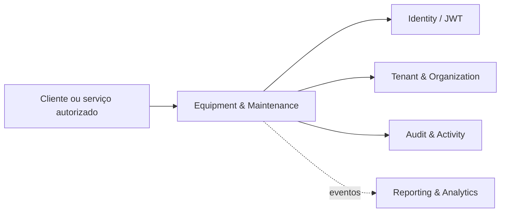

# Arquitetura e responsabilidades — Equipment & Maintenance

## Propósito

Equipamentos, número de série, QR Code, reserva, check-in, check-out, utilização e excedentes. O serviço declara a porta **4780** no ambiente atual.

## Boundary de responsabilidade

| Dentro do boundary | Fora do boundary |
| --- | --- |
| Persistência e regras do domínio de Equipment & Maintenance | Regras pertencentes a outros owners |
| Validação de tenant, organização e autorização | Confiança em dados não assinados do cliente |
| Auditoria das mutações relevantes | Alterações diretas no banco de outro módulo |
| Contratos de integração versionados | Recalcular estados oficiais de outro owner |

## Topologia

## Dependências autorizadas

Agend, Catalog, Entitlements, Billing, Pay, Identity e Tenant & Organization.

Toda dependência deve utilizar o contrato transversal de comunicação, audience e scope mínimos. Nenhum módulo deve abrir acesso direto ao banco de outro módulo.

## Ownership e dados

Equipment registra fatos operacionais; Agend é autoridade temporal, Billing é autoridade monetária e Pay processa a cobrança. Dados persistidos neste repositório devem possuir tenant/organization quando o domínio for multi-tenant, chaves únicas apropriadas, migrations versionadas e trilha de auditoria para alterações sensíveis.

## Evolução

Mudanças de boundary, ownership, estado ou contrato devem ser registradas em ADR antes da implementação. Mudanças incompatíveis exigem nova versão de contrato e janela de compatibilidade.

## Referências

[1]: https://github.com/operaon/equipment "Repositório Equipment & Maintenance"
[2]: https://github.com/operaon/api "API Gateway Operaon"
[3]: https://github.com/operaon/identity "Identity Operaon"
